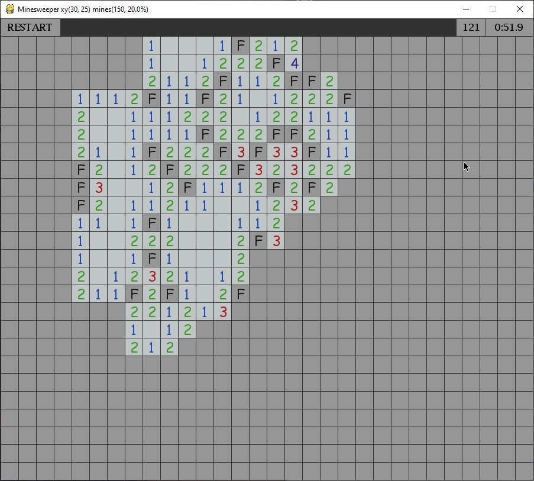
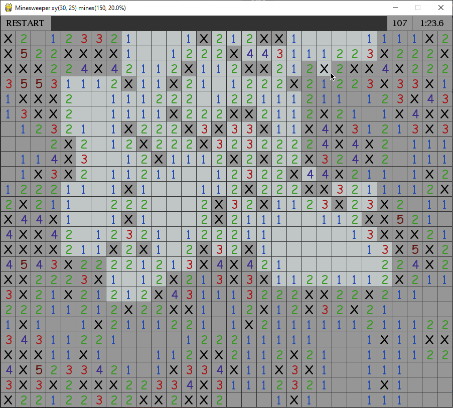

# Miinaharava Projekti
Tehnyt: Julius Väistö

Pelin pelaamiseen tarvitset [pythonin 3.8+](https://www.python.org/downloads/) ja [Pygamen](https://www.pygame.org/wiki/GettingStarted), sekä [python tiedoston](minesweeper.pyw).

Peli on täysin toimiva, nopea ja pelin koodi on helppolukuista. Toimii normaaleilla pelin säännöillä. Lisäksi peliin on tehty ominaisuuksia, jotka poistavat tiettyjä epäreiluja tilanteita.

Yleiset ohjeet miinaharavaan: [wikipedia.fi](https://fi.wikipedia.org/wiki/Miinaharava_(peli))

Pelaaja klikkaa hiiren vasemmalla näppäimellä paljastamattomia ruutuja: jos ruudussa on miina, se räjähtää ja peli päättyy. Jos ruudussa ei ole miinaa, ruudussa näkyy, monessako ruudun kahdeksasta naapuriruudusta on miina. Oikealla näppäimellä pelaaja voi merkitä lipulla paljastamattoman ruudun, jossa päättelee olevan miinan. Kun kaikki miinattomat ruudut on paljastettu, pelaaja on onnistunut ja hänen tuloksensa on käytetty aika.

Kuvia:

